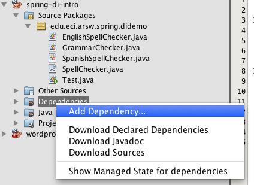
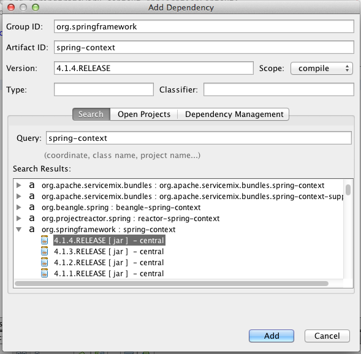
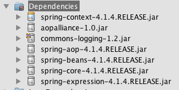
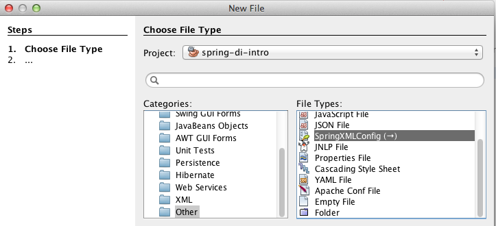
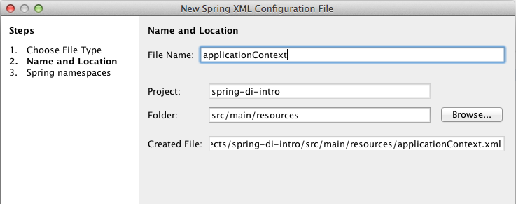
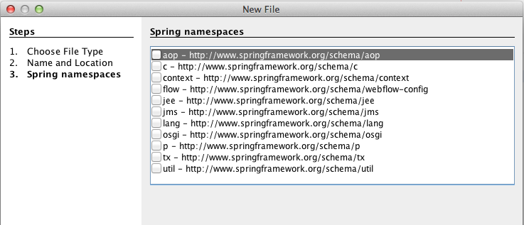
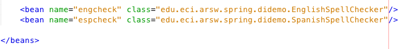
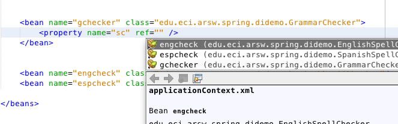

#Escuela Colombiana de Ingeniería
#Arquitecturas de Software - ARSW

##Taller – Principio de Inversión de dependencias, Inversión de Control, Contenedores Livianos e Inyección de dependencias.


Entregables:

-   Ejercicio básico, y un avance del ejercicio principal: antes de
    terminar la clase.

-   Nueva versión del diseño: Próximo martes, en clase (impreso o digital).

-   Solución completa: Próximo Miércoles, antes del siguiente laboratorio.

Parte I. Ejercicio básico.

1.  Clone el proyecto
    <https://github.com/hectorateci/spring-dependencyinjectionexercise-base.git>
    e impórtelo en Netbeans.

2.  Agregue como dependencia de Maven el artefacto ‘spring-context’:

	-   GROUP-ID:org.spring-framework
	-   ARTIFACT-ID: spring-context
	-   VERSION: 4.2.4-RELEASE

	Nota: Con Netbeans puede usar el asistente de búsqueda del repositorio central de Maven:

	
	
  
3.  Verifique que esta nueva dependencia, junto con sus respectivas
    dependencias, se hayan añadido y descargado:

    

4.  Cree un nuevo archivo de configuración de Spring. Aunque el nombre
    puede ser cualquiera, por convención este archivo suele
    llamarse ‘applicationContext.xml’. Como se está usando Maven, dicho
    archivo debe ir en la ruta que por convención se usa para los
    archivos de configuración:

    
    
    
5.  En este paso se le pedirá indicar qué nombres de
    espacio (namespaces) XML se incluirán en el archivo
    de configuración. Como por ahora sólo se usarán los elementos
    básicos, no es necesario incluir ninguno:

    

6.  Edite el archivo de configuración de Spring. Primero, defina dos
    beans: uno correspondiente al corrector ortográfico en español, y
    otro al corrector ortográfico en inglés. Para esto, use las opciones
    de autocompletar para los tags (Ctrl+espacio) y para la selección de la clase:

    

7.  En el mismo archivo agregue un bean correspondiente al
    corrector gramatical. Este bean, a diferencia de los dos anteriores,
    tiene una dependencia a algo de tipo *SpellChecker* llamada
    ‘sc’ (getSc/setSc) que debe ser inyectada, para lo cual se le agrega
    un elemento ‘property’ con el atributo ‘name’ asociado al nombre de
    la propiedad, y con el atributo ‘ref’, que indica qué bean se le
    inyectará a dicha propiedad. Deje la configuración de manera que se
    use el corrector ortográfico para español.

    

8.  Haga un programa de prueba, donde se cree una instancia de
    GrammarChecker mediante Spring, y se haga uso de la misma.

	```java
	
	public static void main(String[] args) {
		ApplicationContext ac=new ClassPathXmlApplicationContext("applicationContext.xml");
		GrammarChecker gc=ac.getBean(GrammarChecker.class);
		System.out.println(gc.check("la la la "));
	}
	```

9.  Modifique el archivo de configuración de Spring para que el Bean
    ‘grammarChecker‘ ahora haga uso de la clase SpanishSpellChecker (para
    que a GrammarChecker se le inyecte *EnglishSpellChecker* en lugar de
    *SpanishSpellChecker*. Verifique el nuevo resultado.


####Parte II. 

Para este ejercicio, va a hacer un proceso de _refactoring_ de una implementación del popular juego 'ahorcado'. El código está basado en el proyecto creado por Omar Rodriguez, Nahid Enayatzadeh, Marc Deaso, Christopher Santos, Jazmin Guerrero, y que está disponible en https://github.com/oarodrig/SwingHangman .


Se quiere tomar el código base 

* Desacoplar la lógica del juego de la representación del estado del mismo, pues en algunos países no se ve con buenos ojos la representación gráfica del ahorcado.

* Desacoplar la lógica del juego del idioma usado en el mismo. En este sentido, se debe tener en cuenta que el idioma considera: 
	* El juego de caracteres.
	* El conjunto de palabras.
	* Los textos usados en la interfaz de usuario.
	
En particular, este ejercicio requiere:

1. Aplicar el principio de Inversión de Dependencias en los elementos antes mencioandos, agregando las interfaces y ajustando las dependencias que hagan falta.
2. Integrar en el proyecto el framework Spring, de manera que a través de este se pueda -en tiempo de ejecución- realizar la inyección de las dependencias que hagan falta.
3. Implementar el siguiente conjunto de 'beans' asociados al aspecto visual:

	* Representación estándar: el ahorcado convencional.
	* Representación amistosa: en lugar del ahorcado, se mostrará un signo de adiración sobre el personaje cada vez que se cometa un error:
	
		
4. Implementar el siguiente conjunto de 'beans' asociados al aspecto idiomático:

	* Elementos de interfaz en inglés: los usados actualmente.
	* Elementos de interfaz en francés: textos de la interfaz (botones, etiquetas, etc) en francés, juego de caracteres incluyendo: à, è, ì, ò, ù., un conjunto fijo de palabras en francés.
	* Elementos de interfaz para latinoamérica: textos de la interfaz (botones, etiquetas, etc) en español, juego de caracteres incluyendo la ñ. Para el caso del español, debe poder inyectar una de las siguientes fuentes de datos:
		1. Un conjunto estático de no más de 10 palabras.
		2. Un conjunto cargado a partir de una URL que apunte a un listado de palabras en texto plano (la cual también debe poderse inyectar), usando por ahora la siguiente: https://raw.githubusercontent.com/javierarce/palabras/master/listado-general.txt


##Criterios de evaluación

1. Funcionalidad. La aplicación debe poderse configurar para
	* Usar cualquiera de los dos esquemas gráficos planteados.
	* Funcionar en inglés, francés o español.
	* En caso de funciónar en español, se debe poder elegir que las palabras usadas sea las de un conjunto pequeño predeterminado, o la de una fuente de datos en línea (indicando la URL como parámetro).
2. La solución debe quedar abierta para extensión y cerrada para modificación. Es decir, debe permitir (sólo creando nuevos Beans y ajustando la inyección de dependencias donde corresponda):
	* Agregar nuevas representaciones visuales para el jugador.
	* Agregar el soporte a nuevos idiomas.
	
3. Diseño de la solución:
	* El diseño debe permitir un único punto de creación de Beans.
